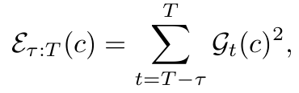

# Diffusion Sampling Path Tells More: An EfficientPlug-and-Play Strategy for Sample Filtering
This is the official implementation for the paper "Diffusion Sampling Path Tells More: An Efficient Plug-and-Play Strategy for Sample Filtering". 
We propose the CFG-Rejection method to filter low-quality samples at an early stage of the denoising process, utilizing the the cumulative divergence between conditional and unconditional scores, which we define as Accumulated Score Differences (ASD).

Above is a direct comparision which provides a visual demonstration to give an early glimpse into the remarkable effectiveness of the ASD metrics in distinguishing the distribution of good and bad samples. This is a visual text rendering for the prompt "A night sky with constellations forming the words ’Among the stars, we find our dreams and destiny’". Low-ASD images (top row) exhibit completely missing strokes, while high-ASD samples (bottom row) ensure textual requirements.

# Methodoloty
Our method is visualized as follows. The key insight stems from the observation that the cumulative divergence between conditional and unconditional score predictions during classifier-free guidance strongly correlates with a sample’s likelihood of originating from high-density regions of the data manifold. Therefore, we define the Accumulated Score Differences (ASD) as the metric to conduct the filtering: 

The proposed CFG-Rejection framework consists of three key steps: 1) Score difference tracking: record the instantaneous score difference at each denoising step. 2) Partial differences accumulation: compute the cumulative score differences from a predefined step τ. 3) Sample selection: discard low-potential trajectories based on a threshold γ. Our method integrates seamlessly into existing generation pipelines with minimal computational overhead. By enabling early-stage filtering through an intrinsic, self-contained metric, it substantially reduces the cost associated with full denoising and reliance on external reward models.