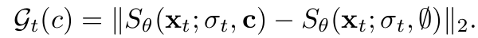
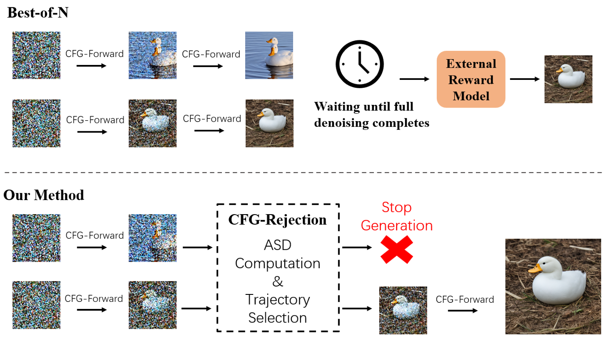
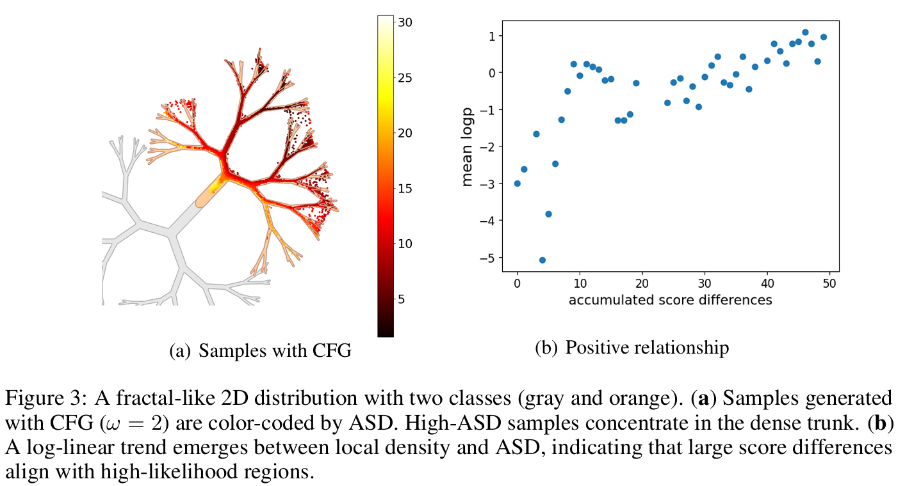
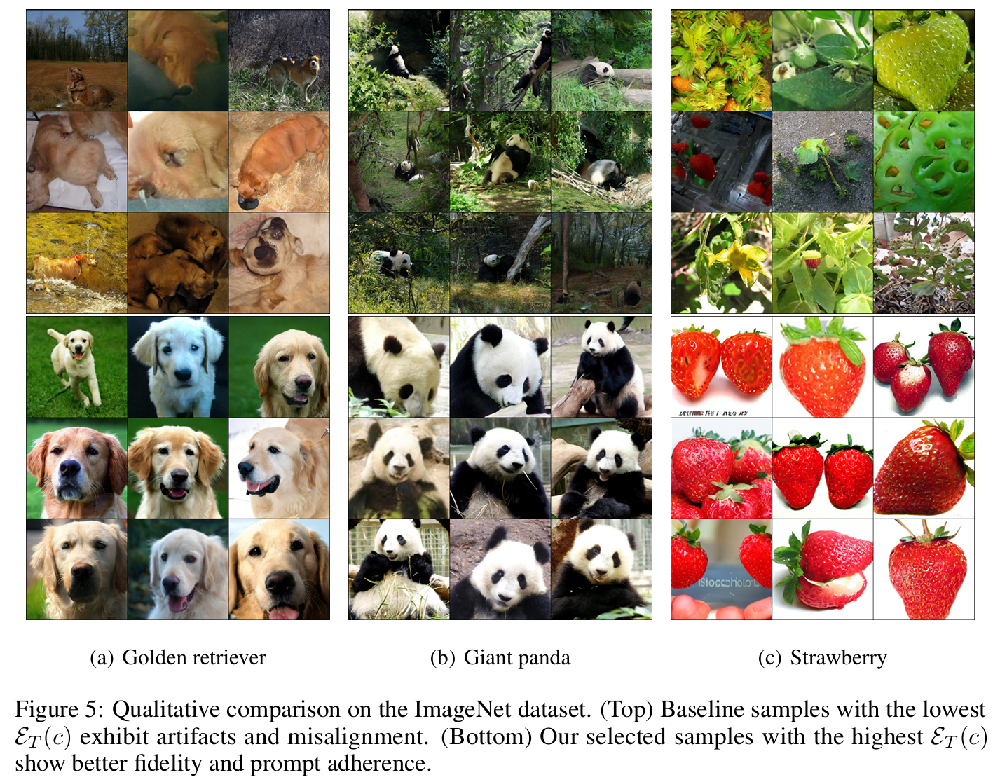

# Diffusion Sampling Path Tells More: An EfficientPlug-and-Play Strategy for Sample Filtering
This is the official implementation for the paper "Diffusion Sampling Path Tells More: An Efficient Plug-and-Play Strategy for Sample Filtering". 
We propose the CFG-Rejection method to filter low-quality samples at an early stage of the denoising process, utilizing the the cumulative divergence between conditional and unconditional scores, which we define as Accumulated Score Differences (ASD).

Above is a direct comparision which provides a visual demonstration to give an early glimpse into the remarkable effectiveness of the ASD metrics in distinguishing the distribution of good and bad samples. This is a visual text rendering for the prompt "A night sky with constellations forming the words ’Among the stars, we find our dreams and destiny’". Low-ASD images (top row) exhibit completely missing strokes, while high-ASD samples (bottom row) ensure textual requirements.

# Methodoloty
The key insight stems from the observation that the cumulative divergence between conditional and unconditional score predictions during classifier-free guidance strongly correlates with a sample’s likelihood of originating from high-density regions of the data manifold. 
We first define the score differences as:

Then, we define the Accumulated Score Differences (ASD) as the metric to conduct the filtering: 

Our method is visualized as follows.

The proposed CFG-Rejection framework consists of three key steps: 
* __Score difference tracking__: record the instantaneous score difference at each denoising step. 
* __Partial differences accumulation__: compute the cumulative score differences from a predefined step τ. 
* __Sample selection__: discard low-potential trajectories based on a threshold γ. 

Our method integrates seamlessly into existing generation pipelines with minimal computational overhead. By enabling early-stage filtering through an intrinsic, self-contained metric, it substantially reduces the cost associated with full denoising and reliance on external reward models.

# Experiment
We first observe the geometrc correlation between samples and ASD on a toy example given by: https://github.com/NVlabs/edm2. The tutorial codes are provided in the `toy example` folder. Shown as figures bellow, high-ASD samples concentrate in the dense central region with strong class consistency, while low-ASD samples tend to appear in sparse regions with weaker semantic alignment.

We further demonstrate our observation with Average k-Nearest Neighbor (AvgkNN) and Local Outlier Factor (LOF) curves on the ImageNet dataset. Several human preference metrics (PickScore, Aesthetic Score and HPSv2) are utilized to have a quantitative comparison for the filtering images. Corresponding codes are provided in the `ImageNet` folder. The qualitative comparisons for images from three different labels are shown as follows:

We further demonstrate the effectiveness of our method with SDv1.5 and SD3 on the benchmark Geneval and DPG-Bench. Corresponding codes are provided in the `benchmark` folder.

We also test applicability of our method to the state-of-the-art Flux diffusion architecture on a set of challenging visual text rendering tasks. Corresponding codes are provided in the `flux` folder.